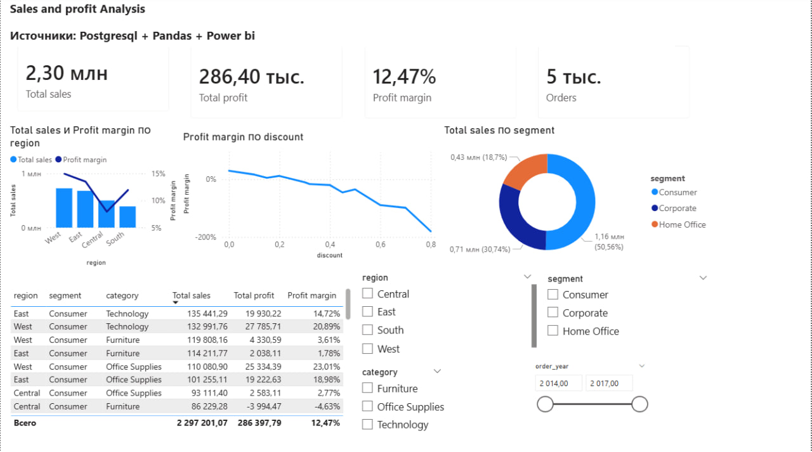

# Анализ продаж и прибыли (Superstore)

## 📌 Описание проекта
Сквозной аналитический проект по анализу продаж и прибыли на данных Superstore.

Проект охватывает полный цикл аналитики:
- подготовка данных в PostgreSQL
- моделирование витрины данных с помощью SQL
- исследовательский анализ в Pandas
- визуализация и бизнес-инсайты в Power BI

---

## 🛠 Используемый стек
- PostgreSQL
- SQL
- Python (Pandas)
- Power BI

---

## 📊 Источник данных
Данные хранятся в PostgreSQL.  
Основная аналитическая витрина — представление v_orders.

---

## 🔍 Ключевые инсайты
- Центральный регион имеет высокий объём продаж, но самую низкую маржинальность
- Маржа резко снижается при уровне скидок выше 20%
- При отсутствии скидок Central показывает наивысшую маржу
- Сегмент Consumer формирует основную часть выручки

---

## 💡 Рекомендации
- Ограничить использование скидок выше 20%
- Пересмотреть ценовую стратегию в Центральном регионе
- Масштабировать продажи без скидок в регионе West

---

## 📈 Дашборд Power BI
Интерактивный дашборд отражает:
- KPI по продажам и прибыли
- анализ по регионам и сегментам
- влияние скидок на маржинальность

## 📈 Дашборд Power BI

